# Diagramas do Sistema - Coisas de Garagem

## Arquitetura Geral

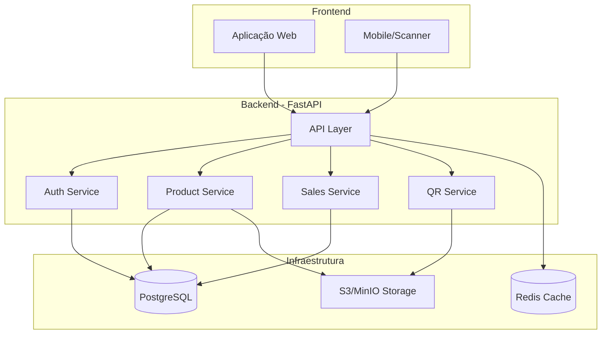

## Fluxo de Autenticação

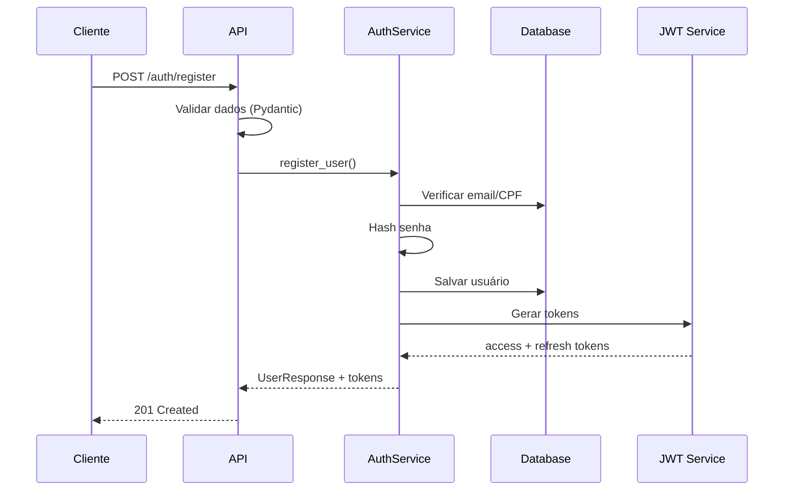

## Fluxo de Criação de Produto

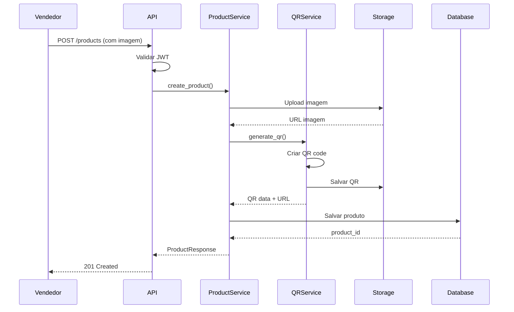

## Fluxo de Compra via QR Code

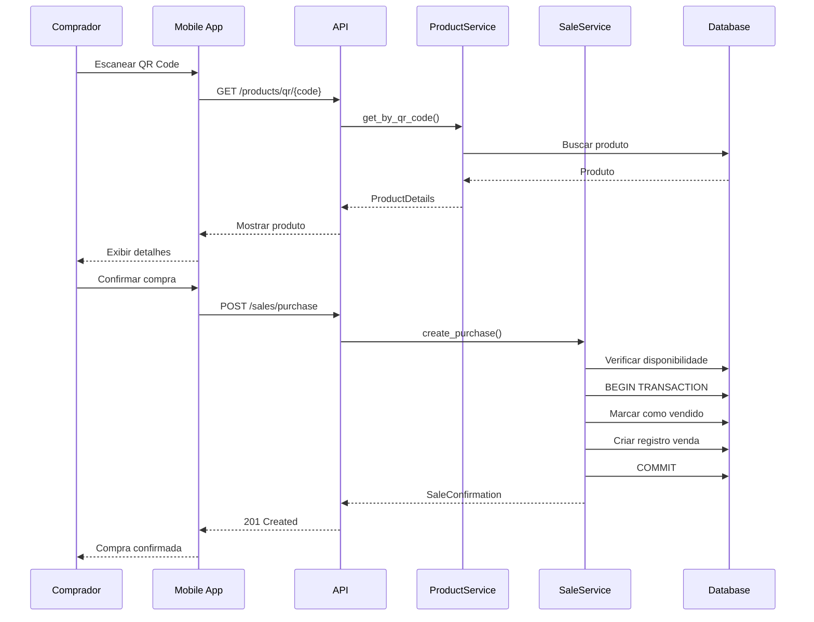

## Estrutura de Classes do Domínio

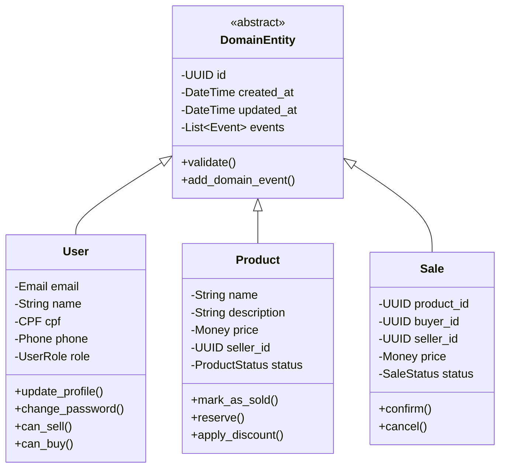

## Value Objects

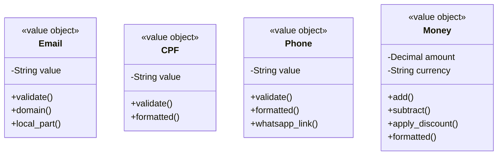

## Camadas da Arquitetura

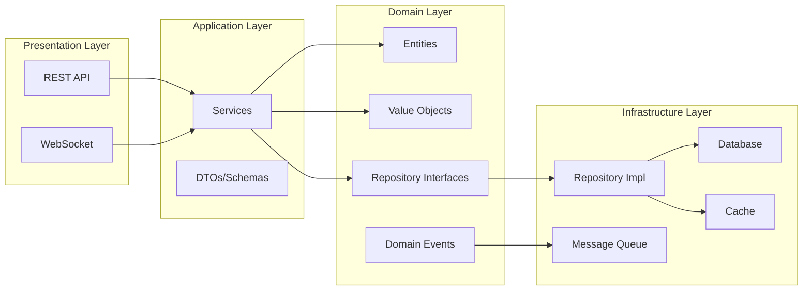

## Estados do Sistema

### Estados do Produto

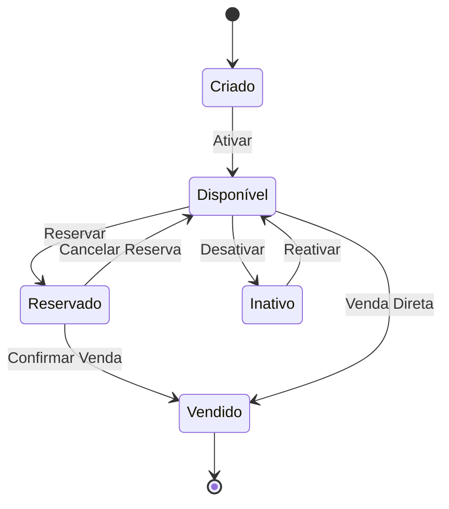

### Estados da Venda

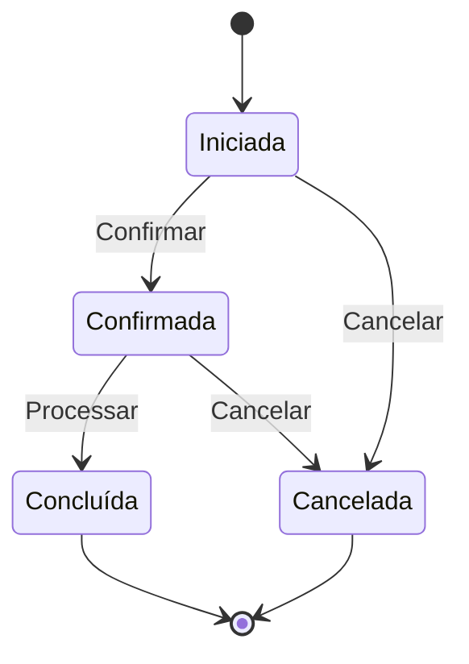

### Estados do Usuário

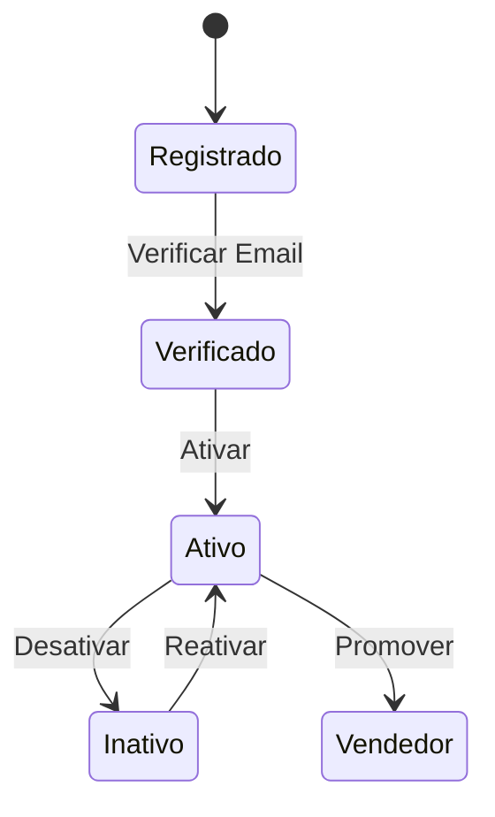

## Fluxo de Cache

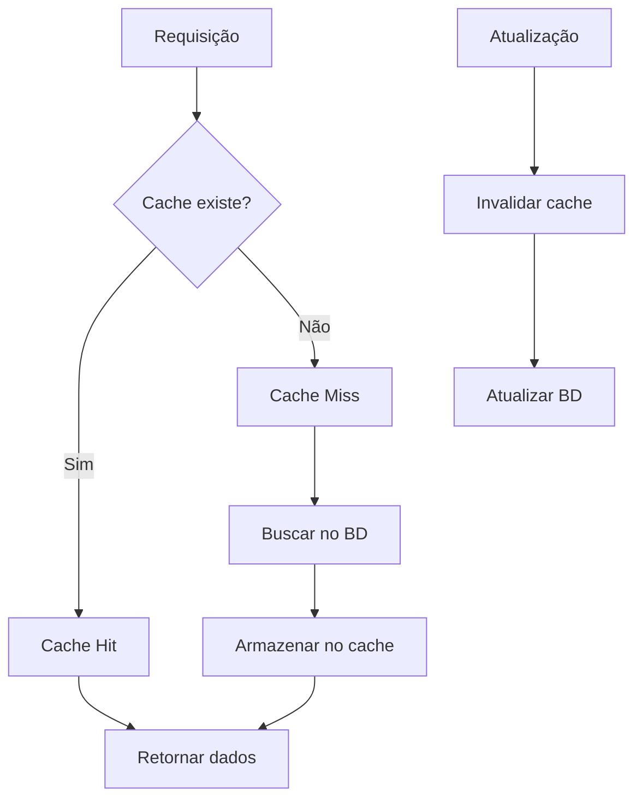

## Pipeline de Deploy

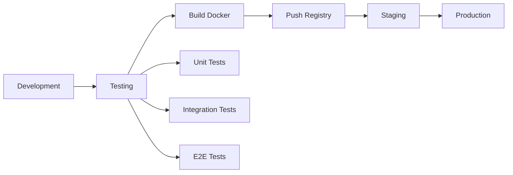

## Componentes do Sistema

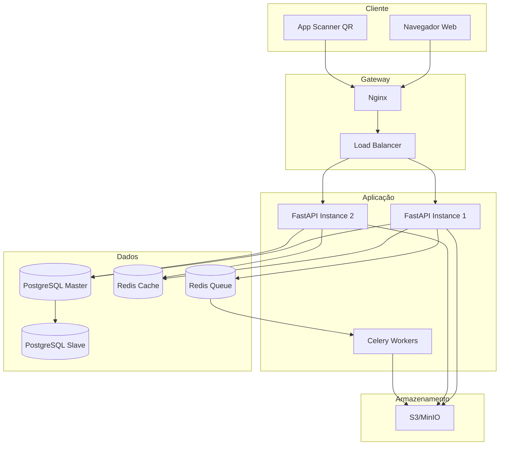

## Modelo de Dados (ER)

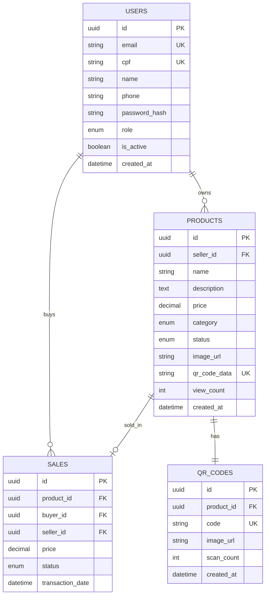